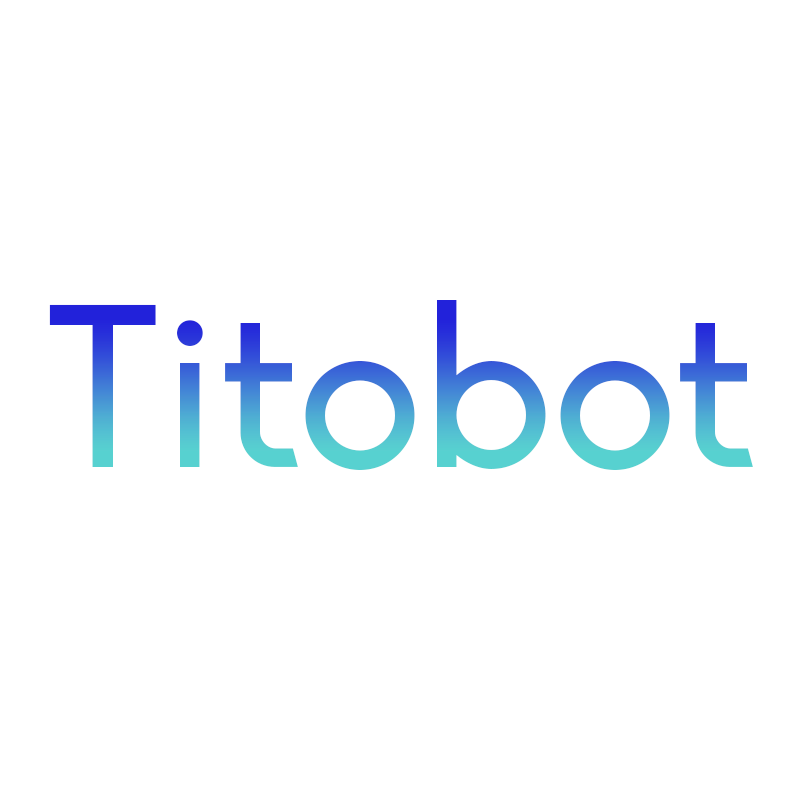

<p align="center"></p>

<h1 align="center">Titobot</h1>

<p align="center">A Discord bot based in discord.js focused in stability, easy-to-use features and variety of commands.</p><hr>

## How to run it

### You will need:
- Node.js 12.0 or higher (in order to run Discord.js)

### Instructions
Simply clone the repo with:
```
git clone https://github.com/Titobot/Titobot
```
Go to the folder with `cd Titobot`, install the dependencies with `npm install`, create a *config.json* file with the next values:  
```
{
    "prefix": "PREFIX",
    "token": "TOKEN"
}
```
and then run it with `node ./index.js`.

### Contact
**Discord**: Titoyan7#7170

#### This project is a personal work and not looks for commercial, long-term use.
